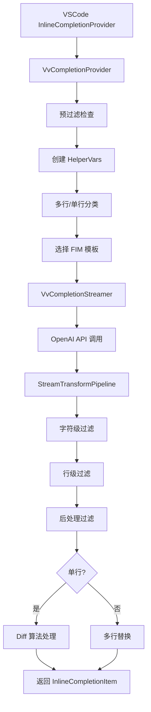

# VVCode 行内补全系统架构与实现

## 目录

- [概述](#概述)
- [整体架构](#整体架构)
- [核心流程](#核心流程)
- [Diff算法详解](#diff算法详解)
- [过滤器系统](#过滤器系统)

---

## 概述

VVCode 的行内补全系统基于 Continue 的架构重构而成，实现了标准 FIM (Fill-In-the-Middle) 模型的代码补全流程。

**当前版本内置 Qwen2.5-Coder-32B-Instruct 模型**，通过统一的 FIM API 端点提供代码补全服务。

### 核心特性

- **Qwen2.5-Coder-32B-Instruct**：内置 320 亿参数指令微调模型，支持多语言代码补全
- **智能 Diff 算法**：自动识别插入/替换模式，避免重复内容
- **多层过滤器**：字符级、行级、后处理三重过滤机制
- **自适应单/多行**：根据上下文自动判断生成单行或多行补全

### 技术说明

- **后端模型**: Qwen/Qwen2.5-Coder-32B-Instruct（内置）
- **API 模型名**: `"FIM"`（统一接口）
- **FIM 模板**: Qwen 标准模板（`<|fim_prefix|>{prefix}<|fim_suffix|>{suffix}<|fim_middle|>`）
- **API 方式**: 非流式 API，一次性获取完整结果

### 文件结构

```
src/hosts/vscode/completion/
├── VvCompletionProvider.ts          # 主入口，协调整个补全流程
├── vvCompletionStreamer.ts          # API 调用管理器（非流式）
├── vvHelperVars.ts                  # 上下文辅助变量缓存
├── vvAutocompleteTemplate.ts        # FIM 模板定义
├── prefiltering.ts                  # 预过滤逻辑
├── multiline.ts                     # 单/多行分类
├── filters.ts                       # 后处理过滤器
├── processSingleLineCompletion.ts   # 单行 Diff 处理
└── streamFilters/
    ├── VvStreamTransformPipeline.ts # 过滤器管道
    ├── charStream.ts                # 字符级过滤器
    └── lineStream.ts                # 行级过滤器
```

---

## 整体架构



---

## 核心流程

VvCompletionProvider.ts 实现了完整的六阶段补全流程：

```
预过滤 → 多行分类 → 模板渲染 → API调用与过滤 → 后处理 → Diff处理(单行)
```

### 阶段 1: 预过滤

**作用**: 快速跳过不需要补全的场景

跳过场景：配置文件、未命名空文件、多光标、特殊文件模式

### 阶段 2: 多行分类

**作用**: 判断应生成单行还是多行补全

判断逻辑优先级：
1. Intellisense 选中项 → 强制单行
2. 单行注释检测 → 强制单行
3. 语言特定规则
4. 默认 → 允许多行

### 阶段 3: 模板渲染

**作用**: 将前缀/后缀按 Qwen FIM 格式组装

模板格式：`<|fim_prefix|>{prefix}<|fim_suffix|>{suffix}<|fim_middle|>`

### 阶段 4: API 调用与过滤

**作用**: 调用 FIM API 并应用过滤器

- 使用非流式 API，一次性获取完整结果
- 将结果传递给过滤器管道处理
- max_tokens: 单行 64，多行 128

### 阶段 5: 后处理

**作用**: 最终验证补全质量

过滤规则：
1. 空白过滤
2. 重复上一行检测（Levenshtein 距离 < 10%）
3. 极端重复检测（6行以上重复）
4. 去除重复空格和 Markdown 代码块

### 阶段 6: Diff 处理（单行专用）

**作用**: 智能判断插入还是替换

- 单行使用 Diff 算法精确处理
- 多行直接替换到行尾

---

## Diff算法详解

### 核心问题

FIM 模型可能以三种方式生成补全：
1. **纯插入**: 只生成新内容
2. **重复后缀**: 生成的内容包含了光标后已存在的代码
3. **部分重复**: 生成内容与光标后代码部分重叠

**不使用 Diff 的后果**:

```typescript
// 场景：光标位置 |
// 当前代码: console.log("hello")|)
// 补全内容: .trim())

// 错误结果（直接插入）:
console.log("hello").trim())  // 多了一个 )

// 正确结果（Diff 处理）:
console.log("hello").trim())  // 正确
```

### Diff 实现

使用 `diff.diffWords()` 比较**光标后文本**和**补全文本**：

```typescript
function processSingleLineCompletion(
    lastLineOfCompletionText: string,  // 补全的最后一行
    currentText: string,               // 光标后到行尾的内容
    cursorPosition: number
): SingleLineCompletionResult | undefined
```

### Diff 模式匹配

**模式表示**: `+` = 新增，`-` = 删除，`=` = 相同

#### 模式 1: `[+]` - 简单插入

```typescript
// currentText: ""
// completion: "foo()"
// → 在光标位置插入，range = undefined
```

#### 模式 2: `[+,=]` 或 `[+,=,+]` - 重复后缀

```typescript
// currentText: "bar()"
// completion: "foo.bar()"
// → 替换整行剩余部分，range = { start: cursor, end: lineEnd }
```

**示例**:
```
// 之前: console.log("hello")|)
// completion: ".trim())"
// 结果: console.log("hello").trim())  ✅
```

#### 模式 3: `[+,-]` 或 `[-,+]` - 行中插入

```typescript
// 行中间插入，不替换后续内容
// range = undefined
```

#### 模式 4: 其他 - 降级处理

使用第一个新增部分，或作为简单插入处理

### Range 语义

```typescript
// range = undefined
// → VSCode 在 position 处插入文本

// range = { start: 10, end: 20 }
// → VSCode 删除 [10, 20)，然后插入文本
```

### 多行补全处理

多行补全不使用 Diff，直接替换到行尾：

```typescript
range = new Range(startPos, document.lineAt(startPos).range.end)
```

**原因**:
- 多行 Diff 计算成本高
- 多行内容重复概率低
- 用户期望多行补全"接管"剩余内容

---

## 过滤器系统

### 三层过滤架构

```
LLM 完整输出（非流式）
    ↓
字符级过滤 (charStream.ts)
    ↓
行级过滤 (lineStream.ts)
    ↓
后处理过滤 (filters.ts)
    ↓
最终补全
```

**说明**: 虽然使用 `async generator` 语法，但实际处理的是**完整文本**而非实时流式数据。

### 字符级过滤器

**位置**: streamFilters/charStream.ts

#### 1. `stopAtStopTokens` - Stop Token 检测

维护滑动窗口缓冲区，一旦匹配任何 stop token，立即停止。

```typescript
// stopTokens: ["<|endoftext|>", "<fim_prefix>"]
// LLM 输出: "function foo() {<|endoftext|>..."
// yield: "function foo() {"  ✅
```

#### 2. `stopAtStartOf` - 后缀重复检测

检查已生成内容是否开始重复 suffix，防止模型生成 "补全 + suffix + 更多内容"。

#### 3. `noFirstCharNewline` - 首字符换行过滤

如果第一个字符是换行符，跳过它，避免补全以空行开始。

### 行级过滤器

**位置**: streamFilters/lineStream.ts

#### 1. `streamLines` / `streamWithNewLines` - 行流转换

字符流 ↔ 行流，允许行级过滤器操作完整的行。

#### 2. `stopAtLines` - 行数限制

超过 50 行自动停止，防止无限生成。

#### 3. `stopAtRepeatingLines` - 重复行检测

维护最近 10 行的哈希表，如果某行重复出现 3 次，停止生成。

```python
# 模型陷入循环
def foo():
    pass
def foo():
    pass
def foo():  # ← 第 3 次重复，停止
```

#### 4. `stopAtSimilarLine` - 相似行检测

与光标下一行比较，使用 Levenshtein 距离判断相似度。如果生成内容与下一行相似度 > 80%，停止。

**用途**: 防止重复生成已存在的代码。

#### 5. `avoidEmptyComments` - 空注释过滤

如果某行只包含注释符号（如 `//` 或 `#`）且无实际内容，跳过该行。

```javascript
// 模型输出
function foo() {
    //
    return 42
}

// 过滤后
function foo() {
    return 42
}
```

#### 6. `noDoubleNewLine` - 双换行过滤

防止连续空行。

### 后处理过滤器

**位置**: filters.ts

#### 1. `rewritesLineAbove` - 重复上一行检测

```typescript
function lineIsRepeated(a: string, b: string): boolean {
    if (a.length <= 4 || b.length <= 4) return false

    const distance = levenshtein.get(a.trim(), b.trim())
    return distance / b.trim().length < 0.1  // 相似度 > 90%
}
```

**示例**:
```javascript
// 上一行: const x = 42
// 补全: const x = 42
// → 被拒绝 ✅
```

#### 2. `isExtremeRepetition` - 极端重复检测

检测 6 行以上的重复模式，使用最长公共子序列（LCS）算法。

**用途**: 检测模型陷入循环生成相同模式。

#### 3. `removeBackticks` - Markdown 代码块清理

移除首行 ` ```language ` 和末行 ` ``` `。

**原因**: 某些模型被训练时包含 Markdown 格式，可能无意中生成代码块标记。

